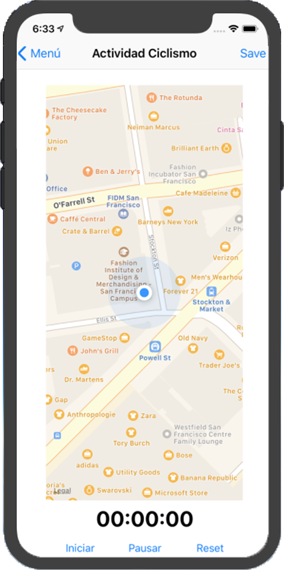

# AppSports

AppSports en una aplicación móvil para IOS diseñada en el entorno de desarrollo de Xcode
y en lenguaje de programación Swift 4.

## Funcionalidad

Se trata de una App deportiva en la que que se podrán seleccionar tres tipos de atividades diferentes: andar, correr y
ciclismo.
 
Seleccionando cada actividad podrá observar en tiempo real a través de un mapa, su ubicación y el recorrido que está
completando.
 
Además de esto tiene diseñado un historial de actividades completadas donde se podrá consultar la fecha de la actividad,
la duración y la distancia completada, asi como la eliminación de la misma.

 ## Menú inicio
 
La aplicación comienza con una escena inicial/menú inicial donde se muestran las distintas actividades que puede realizar
el usuario y el acceso al historial de actividades.

 

## Escena actividad

Seleccionada la actividad deseada el usuario visualizará una escena en la cual podrá ver su ubicación en un mapa, tendrá 
acceso a las funcionalidades de los botones de start, pausar y reset que inician el cronómetro y podrá salvar la actividad
pulsando el botón save.

Por otro lado toda escena de actividad ofrece la opción de volver al menú inicial pulsando dicho botón.

 

## Historial de actividades

Salvada la actividad en la escena anterior, todos los datos se guardarán en tiempo real en Firebase de donde el TableViewController
de la escena historia de actividades recuperará para mostrarlos en las celdas de dicha tabla. Cada celda mostrará la información
de la actividad, la fecha en que se completó, la duración y la distancia.

También se podrá seleccionar la celda mediante el botón edit que dará la posibilidad de eliminarla de la base de datos y 
a parte también se le ofrece al usuario la posibilidad de seleccionar una celda clicando en ella para ver en otra escena,
detalle de la actividad, el mapa con el recorrido y los datos de esa activdad.

 

## Detalle de la actividad

Selecioanda la celda/actividad a consultar el usuario podrá visualizar en detalle accediendo a la escena de detalle
qué recorrido realizó, la fecha, la duración, la fecha y la distancia.

 

## Documentación

* [CocoaPods - Firebase](https://cocoapods.org/pods/Firebase)
* [Firebase](https://console.firebase.google.com)
* [Firebase.Google - Firestore](https://firebase.google.com/docs/firestore/quickstart?hl=es-419)
* [Tutorial YouTube - Ion Jaureguialzo](https://www.youtube.com/watch?v=gIFl3YvMOdM)
* [MapKit](https://developer.apple.com/documentation/mapkit)
* [Swift](https://developer.apple.com/swift/)

