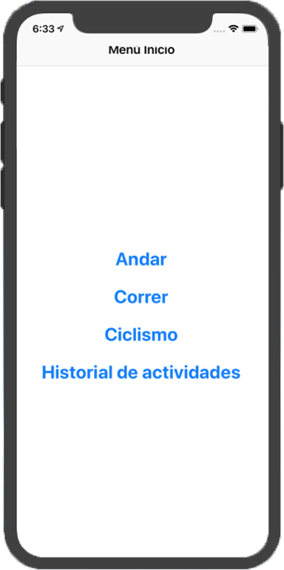

# AppSports

AppSports en una aplicación móvil para IOS diseñada en el entorno de desarrollo de Xcode
y en lenguaje de programación Swift 4.

## Funcionalidad

Se trata de una App deportiva en la que que se podrán seleccionar tres tipos de atividades diferentes: andar, correr y
ciclismo.
 
Seleccionando cada actividad podrá observar en tiempo real a través de un mapa, su ubicación y el recorrido que está
completando.
 
Además de esto tiene diseñado un historial de actividades completadas donde se podrá consultar la fecha de la actividad,
la duración y la distancia completada, asi como la eliminación de la misma.

 ## Manual de usuario
 
La aplicación comienza con una escena inicial/menú inicial donde se muestran las distintas actividades que puede realizar
el usuario y el acceso al historial de actividades.

 
* [CocoaPods - Firebase](https://cocoapods.org/pods/Firebase)
* [Agregar proyecto a Firebase](https://console.firebase.google.com/project/pruebafirebase-d6c51/overview)
* [Firebase.Google - Firestore](https://firebase.google.com/docs/firestore/quickstart?hl=es-419)
* [Tutorial YouTube - Ion Jaureguialzo](https://www.youtube.com/watch?v=gIFl3YvMOdM)

#### TableView
* [Eureka - get-row-value](https://www.youtube.com/watch?v=McvWQOS695M)
* [Tutorial YouTube - Ion Jaureguialzo](https://www.youtube.com/watch?v=McvWQOS695M)

